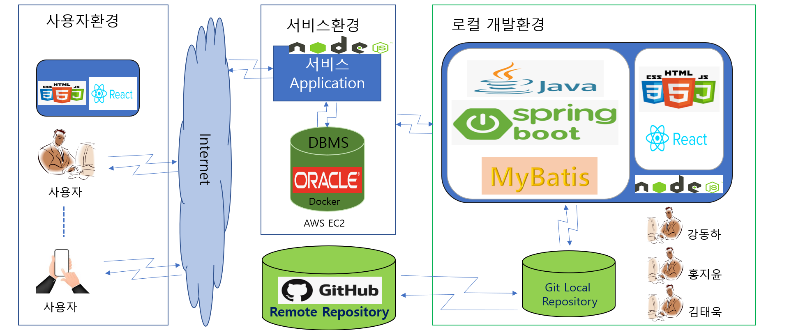
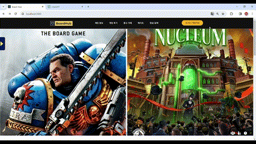

# BoardHub

# [목차]

  1. 프로젝트 개요

  2. 프로젝트 설명

  3. 팀원 내용

# [프로젝트 개요]

  |항목|내용|
  |-------------|-----|
  |프로젝트 소개|남녀노소 나이에 상관없이즐길 수 있는 보드게임을 한곳에 모으고  사용자들 간에 소통을 통해서 서로 같이 즐길수 있는 사이트를 목표로 개발 하였습니다.|
  |개발인원|총 3명|
  |담당역할|강동하(팀장) : 회원가입 및 로그인 / 소셜 로그인 / 실시간 시뮬레이터  홍지윤(테크리더) : OpenAPI 수집 / 게임 리스트 및 상세 구현  김태욱(팀원) : YouTube 영상 스크랩핑 / 커뮤니티 구현 / Editor 구현 전원(DB 설계 / 웹 개발 (Front & Back))
  |개발 기간|총 3주 소요 (2023-10-06 ~ 2023-10-27)
  |성과 및 결과| 기한 내 기능 구현|

# [프로젝트 설명]

  1) 사용기술

       Back-End : Java / Spring Boot, Mybatis 
       Front-End : ReactJS, JavaScript, HTML, CSS 
       Server : Apache Tomcat, Node.JS, AWS EC2, Docker 
       Tools : IntelliJ IDEA / VS Code 
       OS : Windows 10 
       Collaboration : Git / GitHub, Notion 
       DB : Oracle 11g 

2) 목표로한 프로젝트 구조

     

3) 프로젝트 전체 구현 기능

     1. 로그인 및 회원가입

         -> 로그인 : 일반 로그인과 소셜로그인 (구글, 카카오)

             - 일반 로그인 : 회원가입을 통한 로그인
             - 소셜 로그인 : 카카오 또는 구글을 통한 간편 로그인 기능
        
          
           
           
         -> 회원가입 : 이메일 인증을 통한 회원가입

             - 이메일 인증 : 이메일로 인증 번호를 전송 인증번호 틀릴시 가입 불가능
             - 아이디 중복 체크 : 아이디 중복시 사용 불가능
             - 랜덤 닉네임 : 닉네임을 작성하지 않고 등록시 랜덤으로 닉네임 부여

          
           
           
         -> 마이 페이지 : 비밀번호 및 닉네임, 전화 번소 수정

             - 비밀번호 변경 : 자신의 아이디 입력후 이메일인증을하고 비밀번호 변경 가능
             - 닉네임, 전화번호 변경 : 변경 버튼 클릭시 입력창 생성 바로 변경 가능
        
          
           
           

        
